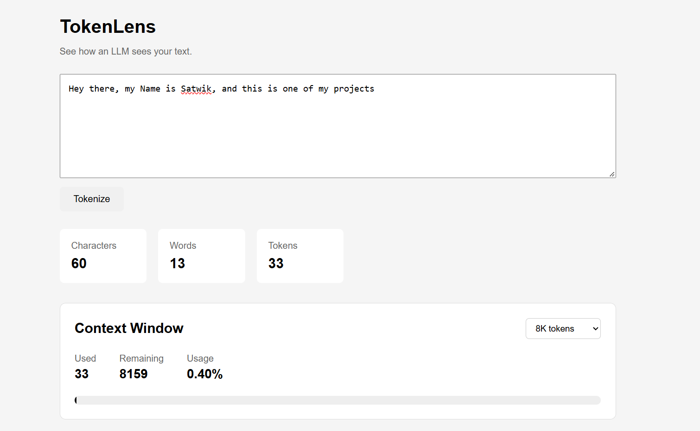
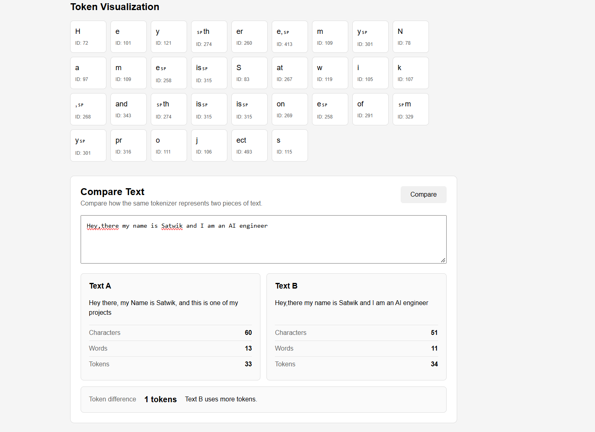

# TokenLens 🔍

> **See how an LLM sees your text.** --> Live link: https://tokenlens-fuj6.vercel.app/

TokenLens is an interactive LLM tokenizer visualizer built to make tokenization easier to understand by showing what happens to text before it reaches a language model.

Instead of treating tokenization as a black box, TokenLens exposes individual tokens, token IDs, UTF-8 bytes, token statistics, and context-window usage.

The project also includes a **from-scratch byte-level BPE tokenizer** implemented in Python, so the tokenization process can be studied and experimented with directly.

---

## ✨ Features

### 🔤 Token Visualization

Enter any text and TokenLens breaks it down into tokens produced by the tokenizer.

For every token, the interface can show:

- Token text
- Token ID
- Token position
- UTF-8 byte representation
- Number of bytes

### 📊 Token Statistics

Quickly see:

- Character count
- Word count
- Token count

This makes it easy to observe how different pieces of text can have very different token counts.

### 🧠 Context Window Simulator

Choose a context window size such as:

- 4K
- 8K
- 16K
- 32K
- 128K

TokenLens then shows:

- Tokens used
- Tokens remaining
- Percentage of context consumed
- Visual usage bar
- Context warnings when usage becomes high

### 🔬 Text Comparison

Compare two pieces of text using the same tokenizer.

TokenLens displays character, word, and token counts for both texts and highlights the difference in token usage.

This makes it easy to experiment with questions such as:

> "Do two texts with similar lengths necessarily use the same number of tokens?"

### ⚙️ From-Scratch Byte-Level BPE

The backend contains an educational implementation of **Byte Pair Encoding (BPE)** rather than relying on a tokenizer library for the core algorithm.

The implementation includes:

- Byte-level vocabulary initialization
- Pair-frequency counting
- Most-frequent-pair merging
- Vocabulary construction
- Merge-rule storage
- Encoding
- Decoding
- Model serialization

---

## 🖥️ Screenshots

### Tokenization & Context Window



The main interface shows the input text, token statistics, and context-window usage.

### Token Visualization & Text Comparison



The token visualization exposes individual token IDs and text fragments, while the comparison section shows how two texts are represented by the same tokenizer.

---

## 🧠 How Tokenization Works

At a high level, the TokenLens BPE training pipeline is:

```text
Training Corpus
      ↓
  UTF-8 Bytes
      ↓
Count Adjacent Pairs
      ↓
Find Most Frequent Pair
      ↓
     Merge
      ↓
Create New Token ID
      ↓
Repeat Until Target Vocabulary Size
```

After training, new text is tokenized using the learned vocabulary and merge rules:

```text
New Text
   ↓
UTF-8 Bytes
   ↓
Learned BPE Merge Rules
   ↓
Token IDs
   ↓
TokenLens Interface
```

### Why byte-level BPE?

The tokenizer starts with the **256 possible byte values** as its base vocabulary.

BPE then learns additional tokens by repeatedly merging frequently occurring adjacent pairs.

For example, a simplified sequence:

```text
a b a b a b
```

might learn:

```text
a b → AB
```

and the sequence becomes:

```text
AB AB AB
```

Further merges can create larger and more useful pieces.

The important idea is that the tokenizer does not need a predefined list of every possible word. It learns reusable byte sequences from the training corpus.

---

## 🏗️ Architecture

```text
┌───────────────────────┐
│       React UI        │
│                       │
│ Token Visualization   │
│ Context Window        │
│ Text Comparison       │
└───────────┬───────────┘
            │ HTTP
            ▼
┌───────────────────────┐
│      FastAPI API      │
│                       │
│      /tokenize        │
└───────────┬───────────┘
            │
            ▼
┌───────────────────────┐
│    BPE Tokenizer      │
│                       │
│ UTF-8 → Bytes → BPE   │
│        → Token IDs    │
└───────────────────────┘
```

### Backend

The backend:

1. Receives text from the frontend.
2. Encodes the text using the custom BPE tokenizer.
3. Inspects each generated token.
4. Returns token information as JSON.

### Frontend

The React frontend consumes the API response and turns the tokenizer output into an interactive visualization.

---

## 🛠️ Tech Stack

### Frontend

- React
- Vite
- JavaScript
- CSS

### Backend

- Python
- FastAPI
- Uvicorn
- Custom byte-level BPE implementation

### Development

- Git
- GitHub
- `uv`
- npm

---

## 🚀 Run Locally

### Prerequisites

Make sure you have installed:

- Python
- `uv`
- Node.js
- npm
- Git

### 1. Clone the repository

```bash
git clone https://github.com/codewolf39/tokenlens.git
cd tokenlens
```

### 2. Start the backend

```bash
cd backend
```

Install/sync Python dependencies:

```bash
uv sync
```

Train the BPE tokenizer:

```bash
uv run python train_bpe.py
```

This generates:

```text
bpe_model.json
```

You should see output similar to:

```text
BPE training complete!
Vocabulary size     : 512
Merge rules learned : 256
...
Round-trip test passed!
```

Start FastAPI:

```bash
uv run uvicorn app.main:app --reload
```

The backend will be available at:

```text
http://localhost:8000
```

FastAPI documentation:

```text
http://localhost:8000/docs
```

### 3. Start the frontend

Open another terminal:

```bash
cd frontend
npm install
npm run dev
```

Then open:

```text
http://localhost:5173
```

---

## 📁 Project Structure

```text
tokenlens/
│
├── backend/
│   ├── app/
│   │   ├── __init__.py
│   │   ├── bpe.py
│   │   ├── main.py
│   │   └── tokenizer.py
│   │
│   ├── bpe_model.json
│   ├── train_bpe.py
│   ├── training_data.txt
│   ├── pyproject.toml
│   └── uv.lock
│
├── frontend/
│   ├── public/
│   ├── src/
│   │   ├── App.jsx
│   │   ├── App.css
│   │   └── main.jsx
│   ├── package.json
│   └── vite.config.js
│
├── docs/
│   └── screenshots/
│       ├── tokenlens-overview.png
│       └── tokenlens-features.png
│
└── README.md
```

---

## 🔍 Why I Built This

Tokenization is one of the first steps in an LLM pipeline, but it is often hidden behind libraries and APIs.

TokenLens was built as a practical way to understand that layer by making the process visible:

```text
Text
 ↓
Tokenizer
 ↓
Token IDs
 ↓
Embeddings
 ↓
Transformer
 ↓
Output Tokens
 ↓
Text
```

The project started as a tokenizer visualization tool and was extended with a custom BPE implementation to understand what actually happens inside a tokenizer.

---

## 📚 What This Project Demonstrates

This project combines concepts from:

- Natural Language Processing
- Large Language Models
- Tokenization
- Byte Pair Encoding
- UTF-8 encoding
- Frequency counting
- Greedy merging
- REST APIs
- React state management
- Frontend/backend integration
- Model serialization
- Git/GitHub

The BPE implementation is intentionally small enough to read and understand rather than hiding the algorithm behind a third-party tokenizer library.

---

## 🔮 Possible Future Improvements

- Visualize the BPE training process step-by-step
- Show pair frequencies during training
- Display learned merge rules
- Allow users to upload their own training corpus
- Add tokenizer vocabulary search
- Add token-cost estimation for different LLM APIs
- Add more tokenizer/model comparisons
- Improve multilingual tokenization analysis
- Add deployment support

---

## 👨‍💻 Author

**Satwik Kumar**

Built as an AI/LLM engineering learning project focused on understanding tokenization and implementing core concepts from scratch.

---

## 📄 License

This project is intended as an educational and portfolio project.
